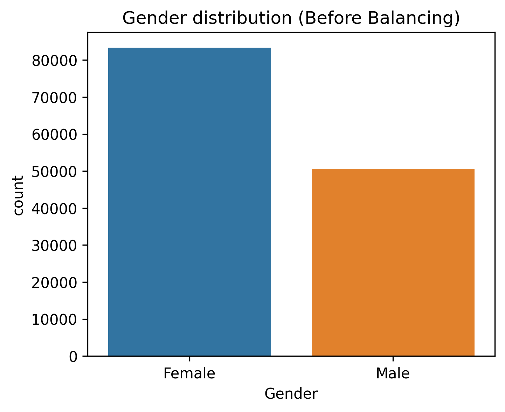
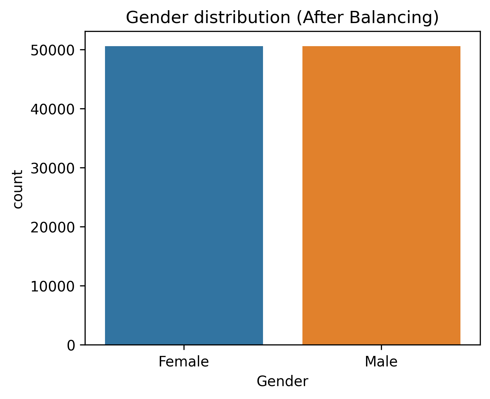
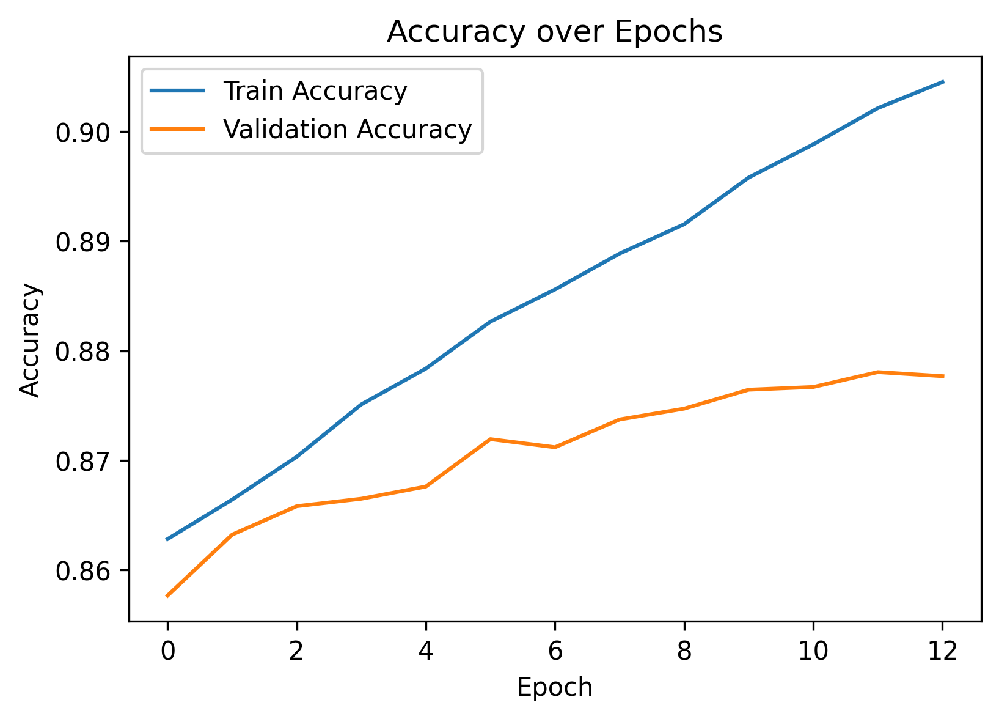
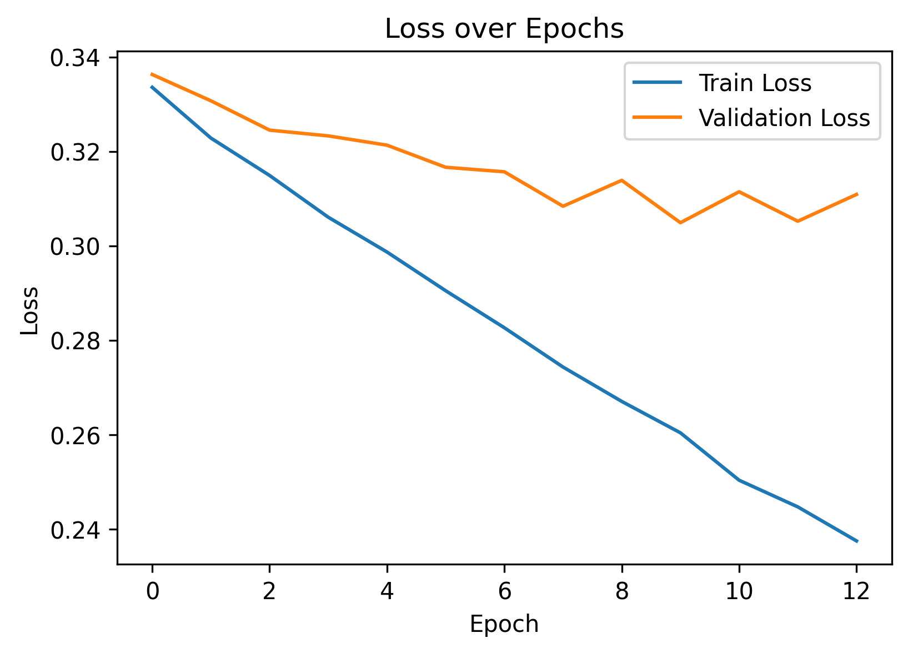
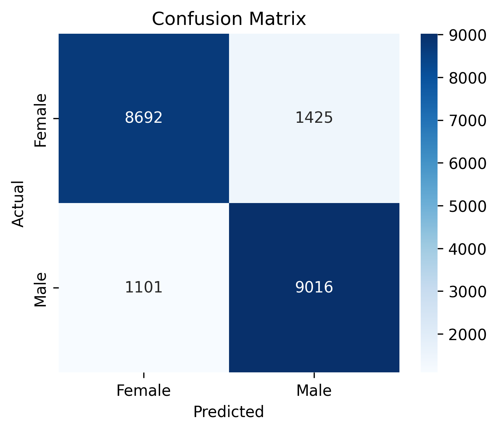

# Gender Classification from Names using Character-level LSTM

## Overview

This project aims to **predict the gender of a person based on their first name** using a character-level Recurrent Neural Network (RNN) with LSTM. The model learns patterns from character sequences in names and classifies them as Male or Female.

The project includes:

- Dataset exploration and preprocessing
- Character-level encoding and padding
- Balanced dataset for unbiased learning
- Bi-directional LSTM model for classification
- Evaluation with accuracy, F1-score, and confusion matrix
- Prediction function for new names

## Dataset

We used the [Gender by Name dataset](https://www.kaggle.com/datasets/gracehephzibahm/gender-by-name) from Kaggle.

- Number of names: 133,910
- Columns:
  - `Name`: First name of a person
  - `Gender`: Gender label (`M` or `F`)
  - `Count`: Number of occurrences in dataset
  - `Probability`: Probability of being Male

## Data Cleaning & Balancing

- Names converted to lowercase and stripped of whitespace.
- Gender encoded as `0 = Female`, `1 = Male`.
- Duplicate names removed.
- Dataset slightly imbalanced:
  - Female: 83,326
  - Male: 50,584

### Before Balancing



### After Balancing

- Undersampled the majority class (Female) to match Male count (50,584 each).



## Preprocessing

- Character-level tokenization:
  - Unique characters extracted from all names.
  - Each character mapped to an integer index.
- Names converted to integer sequences and padded to maximum name length.
- Train/test split: 80% training, 20% testing.

## Model Architecture

- **Embedding layer**: Converts characters to dense vectors.
- **Bidirectional LSTM**: Captures sequential patterns from both directions.
- **Dropout layers**: Prevent overfitting.
- **Dense layer**: Final binary classification with sigmoid activation.

### Model Summary

```
Embedding(input_dim=vocab_size, output_dim=64, input_length=max_len)
Bidirectional(LSTM(128))
Dropout(0.5)
Dense(64, activation='relu')
Dropout(0.3)
Dense(1, activation='sigmoid')
```

## Training

- Optimizer: Adam
- Loss: Binary Crossentropy
- Metrics: Accuracy
- Early stopping and checkpoint used to save the **best model** (`best_gender_name_lstm.h5`).
- Training/validation accuracy and loss curves:

### Accuracy Over Epochs



### Loss Over Epochs



## Evaluation

- **Test Accuracy**: 88%
- Classification report:

```
              precision    recall  f1-score   support

      Female       0.89      0.86      0.87     10117
        Male       0.86      0.89      0.88     10117

    accuracy                           0.88     20234
   macro avg       0.88      0.88      0.88     20234
weighted avg       0.88      0.88      0.88     20234
```

### Confusion Matrix



## Predicting Gender for New Names

```python
def predict_gender(name, model=best_model, char2idx=char2idx, max_len=max_len):
    name = name.lower().strip()
    seq = [char2idx[c] for c in name if c in char2idx]
    padded_seq = pad_sequences([seq], maxlen=max_len, padding='post')
    prob = model.predict(padded_seq)[0][0]
    gender = "Male" if prob > 0.5 else "Female"
    return gender, prob

# Example
name = "Ayesha"
gender, prob = predict_gender(name)
print(f"Name: {name} → Predicted Gender: {gender} (Probability: {prob:.2f})")
```

## Conclusion

- The character-level LSTM model achieves **88% accuracy** on the balanced test set.
- Model is unbiased and performs well for both genders.
- Can be used for **real-time predictions** for new names.

## References

- Kaggle Dataset: [Gender by Name](https://www.kaggle.com/datasets/gracehephzibahm/gender-by-name)
